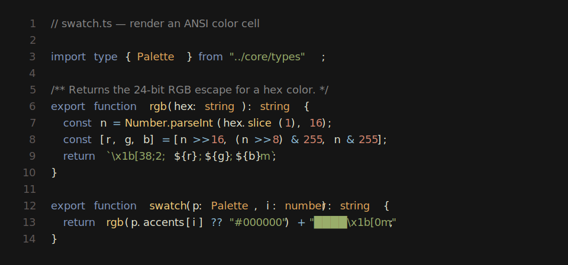
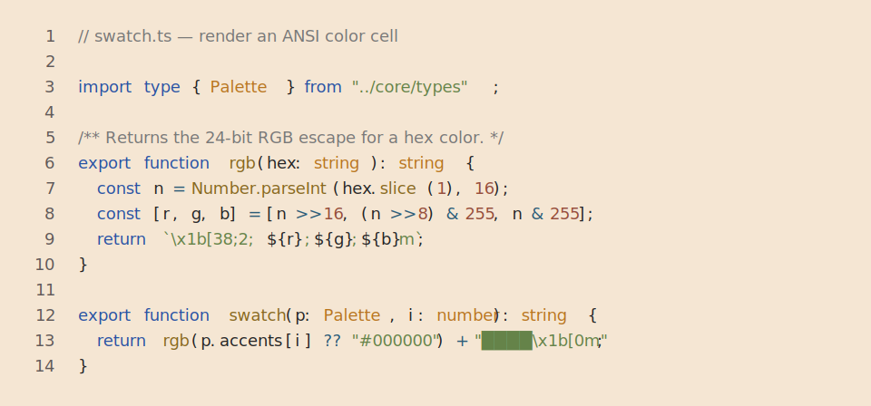
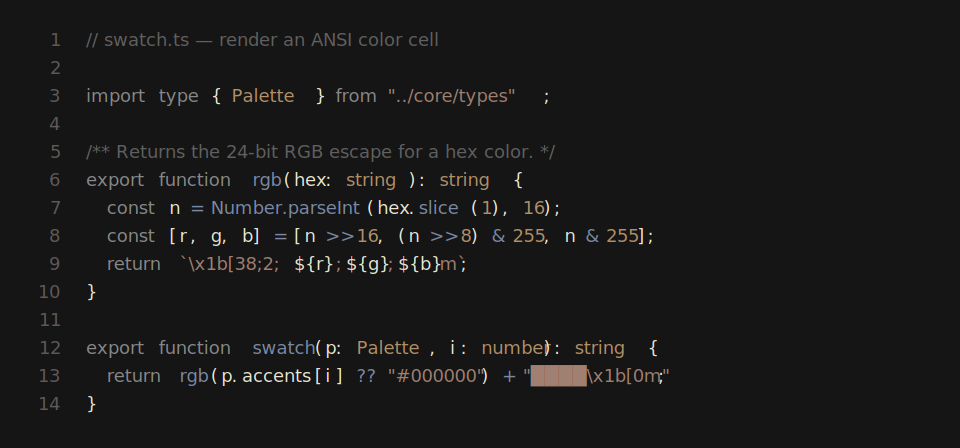
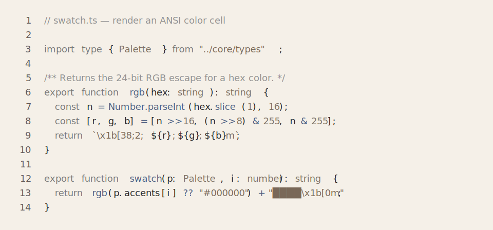
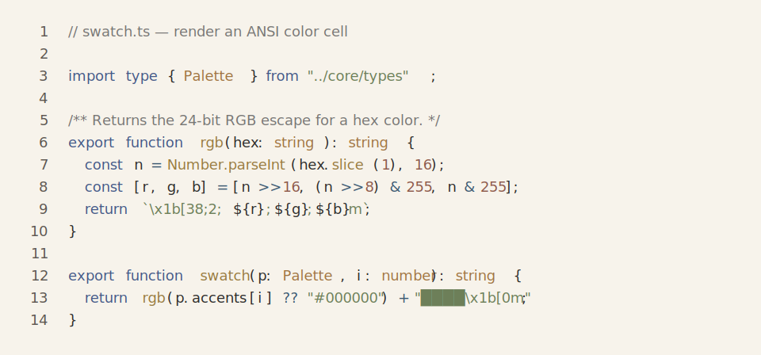
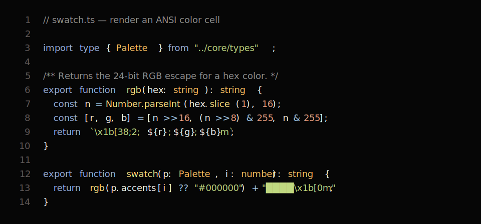
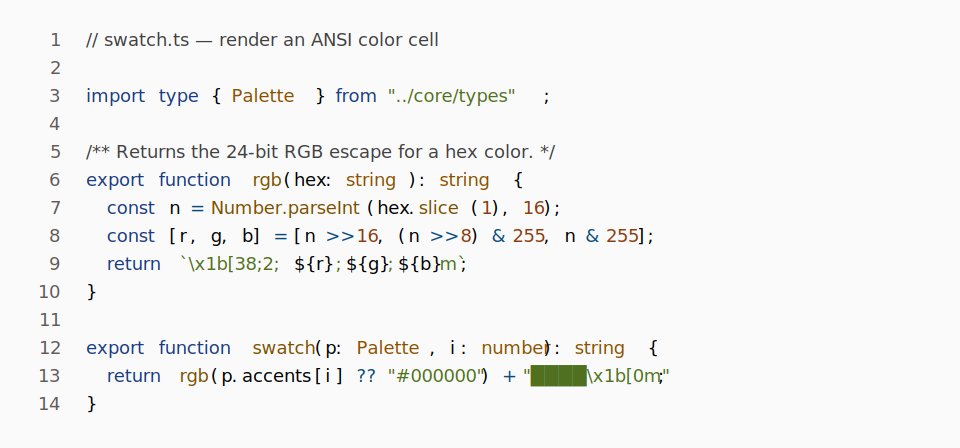
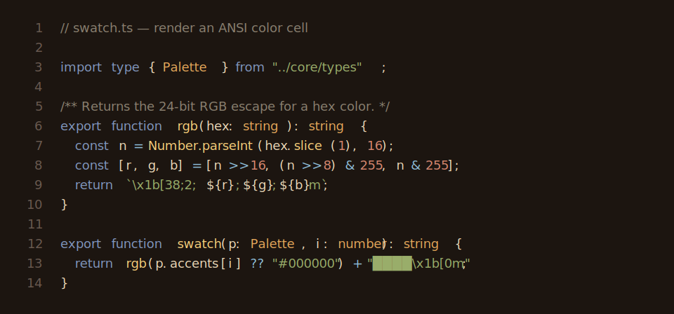

# Senzu

Custom themes for editors and tools, inspired by [github.com/WTFox/jellybeans.nvim](https://github.com/WTFox/jellybeans.nvim).

<!-- BEGIN THEME PREVIEWS -->
## Theme previews

Run `pnpm readme:previews` to regenerate these previews after changing or adding palettes.
Each preview uses the same `packages/cli/src/core/swatch.ts` code snippet shown by `senzu preview`.

### Senzu

### Senzu Light

Senzu Mono

Senzu Mono Light

Senzu Muted

Senzu Muted Light

### Senzu HC

### Senzu HC Light

Senzu Warm

<!-- END THEME PREVIEWS -->
