# Senzu

Custom themes for editors and tools, inspired by [github.com/WTFox/jellybeans.nvim](https://github.com/WTFox/jellybeans.nvim).

## Herdr

Install one explicit variant into a regular Herdr config file:

```sh
senzu install herdr senzu-muted
```

Senzu preserves unrelated TOML settings and comments, creates a timestamped
backup, and prints the command for reloading Herdr. Use `--dry-run` to preview
the updated config. Senzu refuses to modify symlinked configs unless `--force`
is set.

For a Nix-managed Herdr config, consume the theme attrset instead of modifying
the generated config file:

```nix
ad.programs.herdr.settings.theme = inputs.senzu.lib.herdrTheme "senzu-muted";
```

All variants are also available under `inputs.senzu.lib.herdrThemes`.

## Hunk

Hunk reads themes from its TOML config rather than standalone files, so senzu
ships merge-ready snippets in `share/hunk/`. For hunk >= 0.18, copy the tables
from `share/hunk/<variant>.toml` into `~/.config/hunk/config.toml` and set
`theme = "<variant>"`. For hunk <= 0.17, use `share/hunk/<variant>.legacy.toml`
instead, which fills the single-slot `[custom_theme]` table (`theme = "custom"`).

<!-- BEGIN THEME PREVIEWS -->
## Theme previews

Run `pnpm readme:previews` to regenerate these previews after changing or adding palettes.
Each preview uses the same `packages/cli/src/core/swatch.ts` code snippet shown by `senzu preview`.

### Senzu

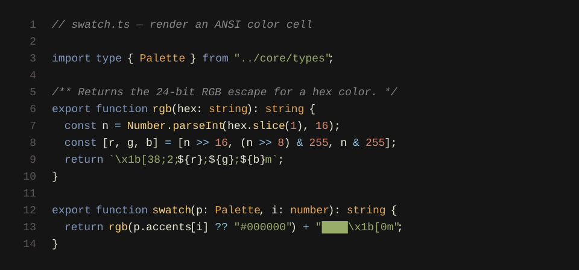

### Senzu Light

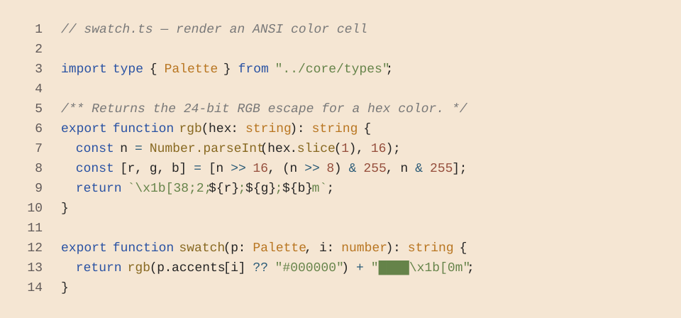

<details>
<summary>Senzu Mono</summary>

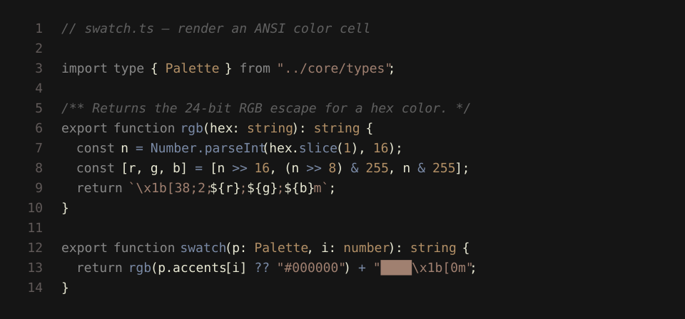

</details>

<details>
<summary>Senzu Mono Light</summary>

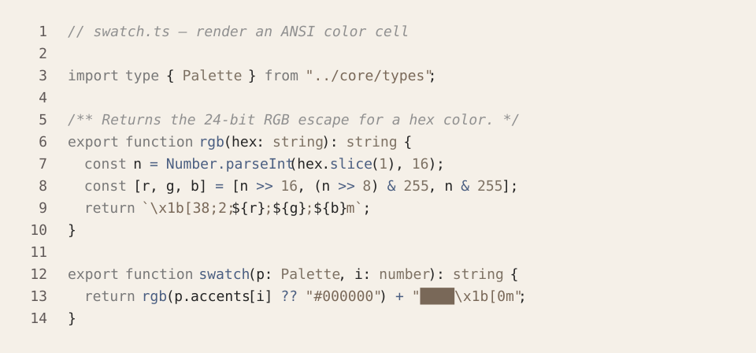

</details>

<details>
<summary>Senzu Muted</summary>


</details>

<details>
<summary>Senzu Muted Light</summary>

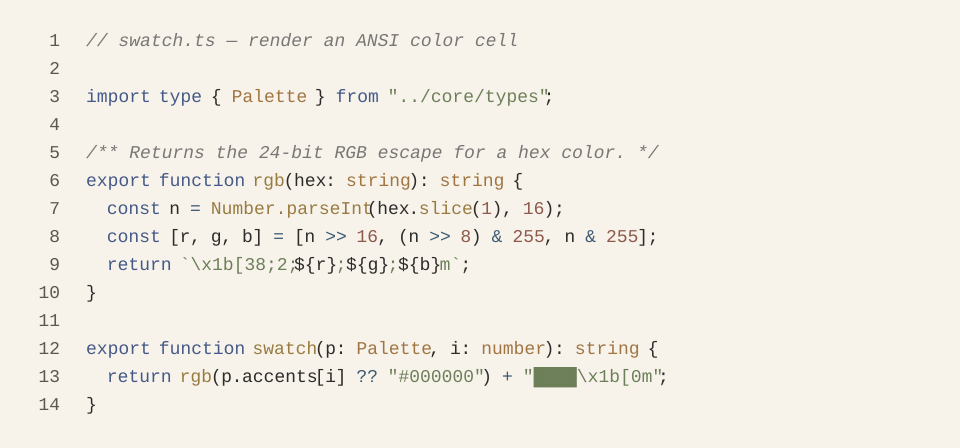

</details>

### Senzu HC

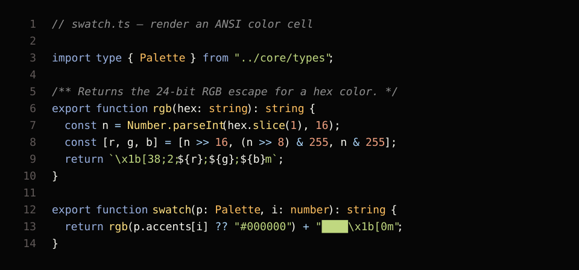

### Senzu HC Light

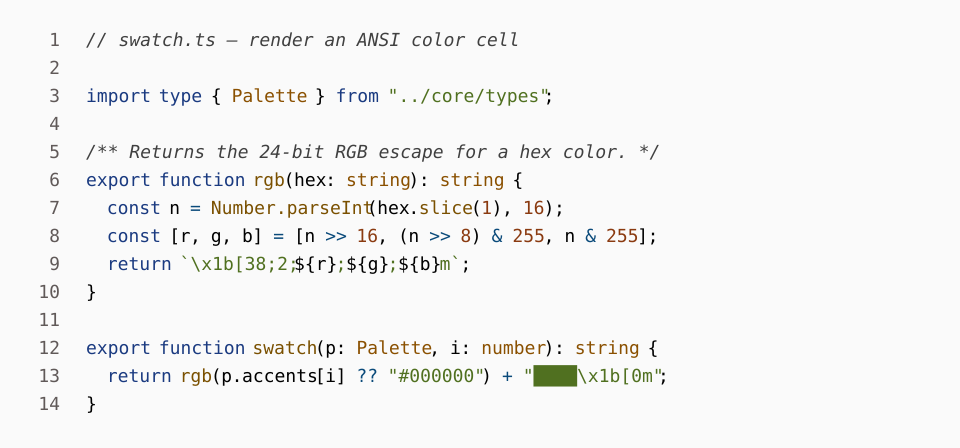

<details>
<summary>Senzu Warm</summary>

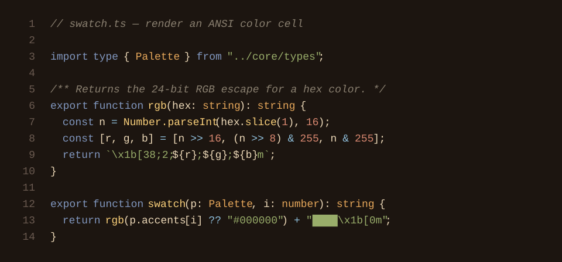

</details>

<details>
<summary>Senzu Warm Light</summary>

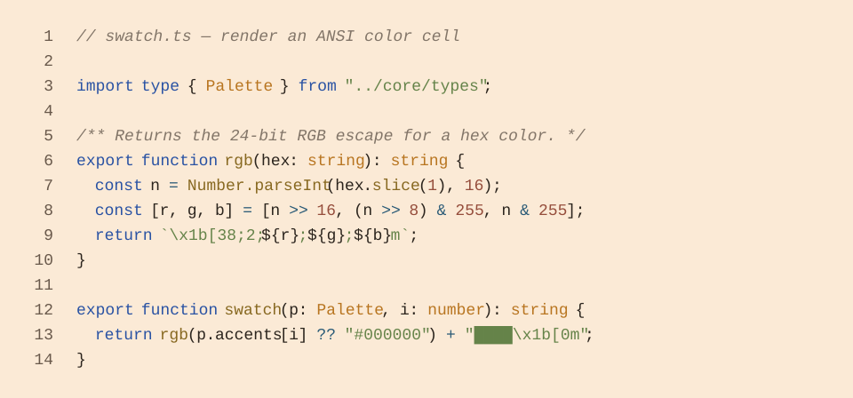

</details>

<details>
<summary>Senzu Cold</summary>

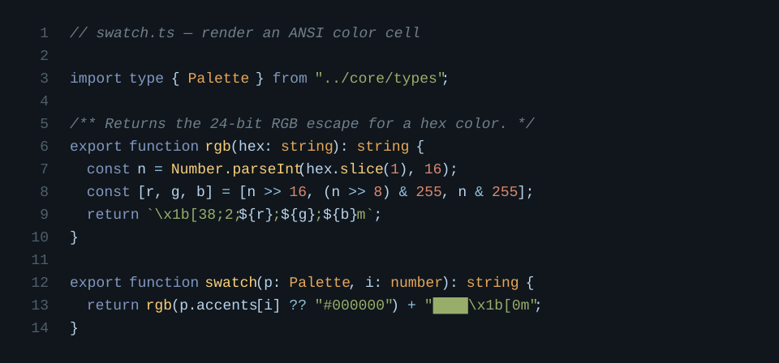

</details>

<details>
<summary>Senzu Cold Light</summary>

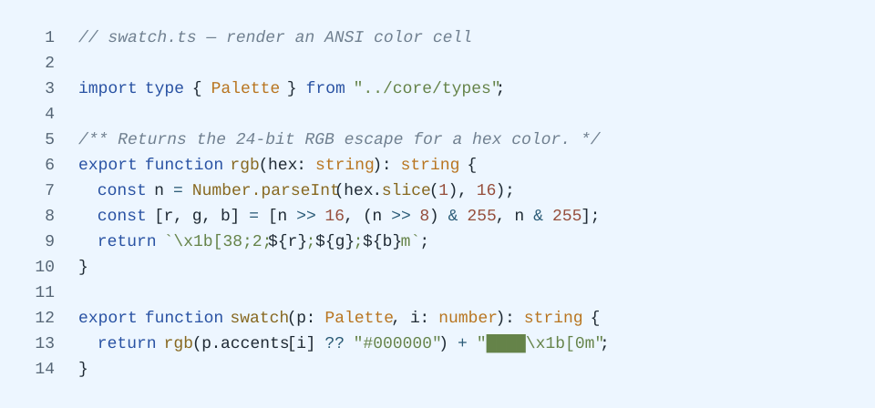

</details>

<!-- END THEME PREVIEWS -->
